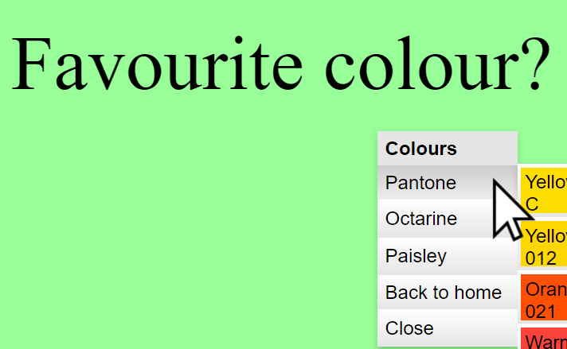

# Downright

A lightweight (<20k minified) right-click context menu HOC for React, with completely customisable theming and transitions.



## Latest version: 0.3.x

0.3 introduces a granular theming system allowing any element in the menu to be fully customised (including swapping in entirely different HTML elements and even whole React components).

Next item on the roadmap is submenus: making them display and work properly, giving them transitions.

## Sample Code

Downright is designed with a minimal API to setup and use in your React app. It provides a HOC to wrap your component to make it emit a context menu. You have access to props The primary use case is that your menu will be dispatching Redux actions, which have been injected into props using Redux. (Downright can be used with )

```javascript
import { contextMenu } from "downright";
import "downright/dist/theme.css";

@connect(null, props => {...})
@contextMenu(props => {
    return [
        "Context menu", // A label or heading
        ["Badger", () => props.onClickedBadger()], // Calling a handler in the parent
        ["Click me", () => props.reduxInjectedAction()], // A button dispatching an action
        ["Fork me", `https://https://github.com/downplay/${props.projectName}`] // Renders a <Link/>
    ];
})
class MyComponent extends Component {
    render() {
        <div>Right-click me to open a menu!</div>;
    }
}
```

## Installation

```
yarn add downright
```

or

```
npm install downright
```

Depending on your flavour.

## Usage

### ContextMenuProvider Setup

Downright follows the provider pattern used by libraries such as Redux. This means you need to wrap the ContextMenuProvider component somewhere around the base of your app tree, usually around where you would put other providers e.g.:

```jsx
import { ContextMenuProvider } from "downright";

<ContextMenuProvider>
    <ReduxProvider store={store}>
        <App />
    </ReduxProvider>
</ContextMenuProvider>
```

Additional notes:

1. The ordering of any other providers you have shouldn't matter at all for DownRight, it just needs to be outside your main App node
2. Multiple providers can certainly co-exist as long as they aren't inside each other, but usually you only need a singleton
3. Currently this will cause an additional wrapping `<div/>` around your entire app. A future version of the package will include the ability to target a layer manually, removing this. Additionally the div should be unneccessary in React v16.

#### properties

These properties affect all context menus under this provider.

`theme: object (default: see "default theme")`

An optional object describing the classNames, styles and elements used to render each type of element in the menu. See sections on "Default Theme" and "Advanced Theming" for information on how to use this property.

`className: string (default: null)`

If provided, this className will be appended to all menu elements. This can be used for transient and individual menu variations beyond the built-in theming support.

`gatherMenus: bool (default: true)`

This affects the behaviour when context connected components are nested inside each other. By default, all context menus will contribute items towards the generated menu. If this is set to false, then only the immediate container clicked on will render its menus.

`reverseOrder: bool (default: false)`

Will reverse the order in which menus are gathered. So instead of the innermost menu items being at top of the menu, *above* menus generated further up in the tree, they will be appended instead.

`menuSeparator: string|node|object (default: "-")`

The item to use as a separator to "glue" together different menus gathered during a context menu event. If only one menu is triggered then no separator will be used. The separator follows the same shorthand for menuItems added in the buildMenu callback (described below). The default `"-"` ultimately generates a single vanilla `<hr>` tag.

`enableTransitions: bool (default: true)`

Whether to enable CSS transition animations for menus (and submenus) entering and leaving the page. When true, the following will happen:

1. A menu that has just appeared will have an `entered` style applied, and this will be immediately removed after first render

2. A menu that is about to be removed will have an `exiting` style applied. The menu component will wait for an onTransitionEnd event before finally removing itself from DOM.

Both `entered` and `exiting` styles can be customised as described in the section on Theming.

### Context Menu connector (HOC / decorator pattern)

The mechanism provided to actually make an area right-clickable is a HOC (Higher Order Component) to wrap another React component. This component must conform to:

1) Rendering at least one DOM node, which click events will be attached to
2) Being a class, not a stateless function.

The HOC can be used as a class decorator, or just wrap programmatically. Its setup is a single callback, which will be invoked when the user triggers a context menu. (And an optional object, which is not implemented yet.)

```javascript
import { contextMenu } from 'downright';

@contextMenu((props) => (
  [
    {...menuItem1},
    {...menuItem2},
  ]
), options)
```

#### ownProps

These are the props as passed through from the parent component. If using Redux, you'll want to `@connect()` *before* `@contextMenu()`, so you receive the props injected by Redux.

Can be used both to create your menu from store data (and outside params), as well as dispatching actions in callbacks.

DownRight is designed for the simplest cast to work nicely with Redux, but it's completely optional, the menu is generic enough to use alongside any React setup.

#### return value

Your configuration callback must return an array of menu items (or null or undefined if no menu needs opening).

Menu items themselves can be defined in various forms:

 - A vanilla string, this will produce a menu label; can also be any React element
 - The special string "-" will produce a separator instead
 - An array of two elements, the first is a string label, the 2nd is either a link destination or callback onClick function
 - A plain JavaScript object with the following properties:

`type: string`
 
 One of: label, button, link, submenu, separator.

`content: string|node`

Content will be rendered inside the menu. Can be a plain string, or a React node. Does not apply for separator.

`onClick: function`

A handler to be called when the button is clicked. Will be passed the Synthetic Event object provided by React when the button is clicked.

`to: string`

URL to navigate to when clicking on the link. The Link component from `react-router-dom` will be used.

`menu: array|function`

Menu to be rendered when the submenu is open. If a function is provided the menu will be rendered on-demand. The function will receive the same parameters as the configuration callback.

#### options

Configures this instance of a context menu. Pass in a plain object with any of these properties:

`stopGathering: bool (default: false)`

If true, this will prevent any further menus being collected from higher-up components as the event bubbles up the component hierarchy.

The provider option `gatherMenus` effectively acts as a global switch for this. If `gatherMenus={false}` then menus will never be gathered past the first connected component, and the `stopGathering` setting is ignored.

### Default Theme

Downright ships with default stylings. How you want to include them depends on your setup and webpack config, but should just be able to do this (once) anywhere in your app. This assumes you are using `style-loader` and/or `extract-text-webpack-plugin` (but not `css-modules`) on 3rd-party modules:

```javascript
import "downright/theme.css";
```

Make sure you 

The styles use collision-free naming. There is an alternative build of Downwrite that uses BEM-style naming classes instead,which you may wish to use if you want to override the styles elsewhere in your own CSS. To use this, you need to import a different CSS file, and provide a theme object to ContextMenuProvider so it know which classNames to use:

```jsx
import "downright/dist/bem/theme.css";
import bemTheme from "downright/dist/bem/theme";

<ContextMenuProvider theme={bemTheme}>
    {...}
</ContextMenuProvider>
```

With any issues loading the styles, see the loader configuration in `/examples/webpack.config.js` to see how this can be used alongside your own CSS modules configuration.

To see what classes are available, you can see the default stylesheet in this file, except that every class must be appended with: `downwrite__contextmenu__`

Default styles are here:

https://github.com/downplay/downright/tree/master/source/styles/menu.css

You can see an example of overriding classes here:

https://github.com/downplay/downright/tree/master/examples/source/examples/Styling.css

#### Advanced theming

The `theme` property of `ContextMenuProvider` exposes an API which allows you to customise any single aspect of the rendering of a Downright menu. Theming uses the [Downstyle](https://github.com/downplay/downstyle) system allowing complete customisation of any element; this adds a very tiny dependency to the package, with tree-shaking this should be less than 3kb *un*-minified. (TODO: Some real stats on bundle sizes!) More documentation on how theming works can be found at [Downstyle](https://github.com/downplay/downstyle), but what follows is a reasonably complete guide to customising the themes.

A theme is a plain object with three optional properties: `classNames`, `styles`, and `elements`. These properties allow you to map different classNames, styles, and elements to different blocks of the rendering of the menu.

In this example we take the base BEM theme, apply some transition styles inline, and swap out the item element for one with completely customised rendering using `styled-components`: https://github.com/downplay/downright/tree/master/examples/source/styles/customMenuTheme.js

The available blocks and styles that can be overridden are:

Block name | Default element | Description
-----------|-------------|-----------------
container | `<nav>` | Root container for the menu. This element will be absolutely positioned.
menu | `<ul>` | Main menu element
item | `<li>` | Menu item element, wraps every child item (one of the following eleemnts)
button | `<button>` | Button item element
link | `<Link>` (from react-router-dom) | Link item element
label | `<div>` | Label item element
separator | `<hr>` | Separator item element
submenu | `<div>` | Submenu item element
selected | n/a | Currently highlighted menu item, by default the same as the :hover style
entered | n/a | Applied to menu when it first appears. Used for transitions.
exiting | n/a | Applied to menu before it leaves. Used for transitions. Menu will wait for transition to end before being removed from DOM.

### Nested Menu Components

It's entirely possible to create nested components that each have the contextMenu wrapper. In this case, as the click event bubbles up through the DOM tree, the Provider will gather all of the menus emitted by each component on the way, and produce a composite menu by concatenating each menu (with a separator in between).

If this is not desirable, the behaviour can be altered by setting `gatherMenus={false}` on the ContextMenuProvider. When this is the case, only the *closest* menu to the mouse click will be utilised. 

## Examples

Examples are found in https://github.com/downplay/downright/tree/master/examples. To run them, clone the repository and execute:

```
npm run build
npm run examples
```

or

```
yarn build
yarn examples
```

Then navigate to `http://127.0.0.1:3311/`

The dev server is hot module enabled so tweak at will.

## Version History

### 0.3.1

- Fixed several styling issues
- Theme helper externalised to `downstyle` package

### 0.3.0

- Brand new theming system, allows override of any class names, inline styles, and elements

### 0.2.5

- Fixed the menu appearing at the wrong page coordinates
- Added an example for nesting menu connectors
- Added option to modify nesting behaviour: reverseOrder (default: `false`)
- Added option to customise separator used during menu building: menuSeparator (default: `"-"`)
- Allow React elements to be used in menu build shorthands, e.g. `@contextMenu(()=>[<h2>Hi, menu!</h2>])`

### 0.2.4

- Added some support for enter/exit CSS transitions with entering/exiting classNames

### 0.2.3

- Added alternate build with BEM classnames to enable styling by global CSS
- Allow className to be passed into the ContextMenuProvider, this will be appended to *all* rendered elements

### 0.2.2

- Don't use style-loader for building package; use extract-text-webpack-plugin and provide an optional stylesheet that can be included by the developer. Added some guidance for this.

### 0.2.1

- Implement options to control gathering (bubbling) behaviour
- Fixed bundling of styles with source

### 0.2.0

Almost complete rewrite, and reasonable default styles. Rewrite paves the way for making rendering fully customisable in 0.3.0. Submenus now supported but could do with more love.

### 0.1.0

First release, basic prototype / proof of concept.

## Bugs and Issues

The roadmap for v1 is getting shorter, but here are the known issues/planned features:

- Submenus are completely broken!
- Handle layout better so menus don't go off the screen
- Ensuring good cross-browser support (should be great, but needs testing)
- Removing the outer <div> added by the provider
- Additional entities - checkbox, etc.

Please report any other bugs or issues on GitHub: https://github.com/downplay/downright

## Copyright

&copy;2017 Downplay Ltd

Distributed under MIT license. See LICENSE for full details.
